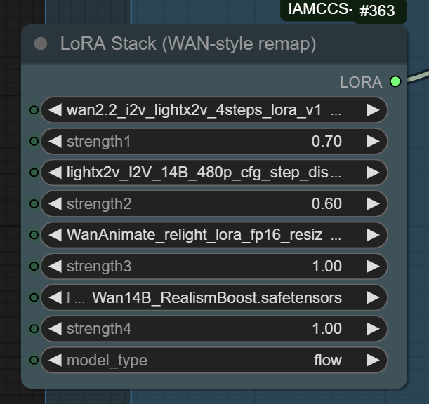
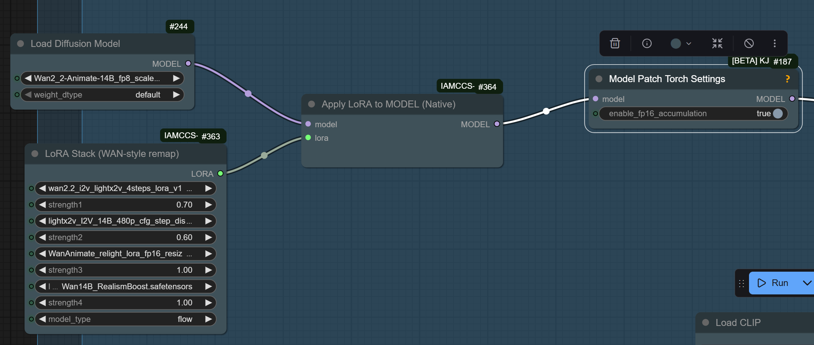
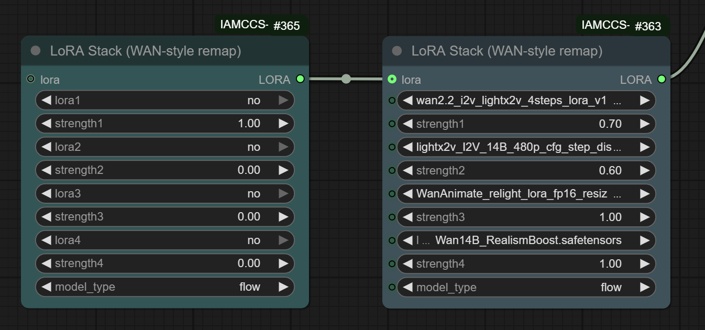

# 🌀 IAMCCS-nodes

## Author: IAMCCS (Carmine Cristallo Scalzi)

### Category: ComfyUI Custom Nodes
### Main Feature: Fix for LoRA loading in native WANAnimate workflows

Version: 1.2.3

# UPDATE VERSION 1-2-3

## 🆕 Version 1.2.3 — New input lora - add another StackLoraModel (concatenate) + Extended Wan 2.1 Compatibility

Version: 1.2.1

# UPDATE VERSION 1-2-1

## 🆕 Version 1.2.1 — Extended Wan 2.1 Compatibility

The **WAN-style remap** node now supports **LightX2V 2.1 LoRA models**.  
This version extends overall compatibility to all LoRA types — even those without dedicated weight tensors (these will simply display a non-critical “missing optional weights” message).  

This ensures smoother cross-compatibility between LightX2V 2.1 / 2.2 and any WAN-based or character LoRA setup.

See full changelog → [CHANGELOG.md](./CHANGELOG.md)

# Overview

The IAMCCS-nodes package introduces a fix for a key limitation in native WANAnimate workflows:
when users run animation pipelines without the WanVideoWrapper, LoRA models fail to load correctly — most weights are ignored, and the visual consistency breaks.

This package contains two complementary nodes that work together to fix this problem and restore full LoRA functionality while keeping the workflow lightweight and modular.

The IAMCCS Native LoRA System introduces an optimized way to handle multiple LoRAs inside native ComfyUI workflows.
It is composed of two interconnected nodes designed to work seamlessly together.

## 1. LoRA Stack (WAN-style remap)

This node lets you combine several LoRA models—especially those made for WAN2.x / Animate / Flow architectures—into one unified output.

](https://github.com/IAMCCS/IAMCCS-nodes/blob/main/assets/lora%20stack.png)

Each LoRA slot includes:

an independent strength control,

automatic WAN-style key remapping for full compatibility,

and support for .safetensors files across any model type (flow, wan, sdxl, etc).

It produces a stacked LoRA bundle that merges all the active LoRAs and prepares them for efficient native injection.

## 2. Apply LoRA to MODEL (Native)

This node applies the generated LoRA stack directly to a loaded diffusion model at the Torch level, without relying on older ComfyUI Apply LoRA wrappers.

Works natively with FP16 accumulation (recommended when paired with Model Patch Torch Settings)

Maintains precision and speed

Fully compatible with WAN2.x and other Flow-type diffusion models

Output: a ready-to-run patched model for image or video generation.

This structure replaces multiple chained LoRA nodes with a single modular system, improving both stability and performance.
Ideal for WANAnimate, WANVideo, or any Flow-based cinematic model.

# New version 1.2.3!! Lora concatenate!! You can add another Lora stack to the node!

lora_concatenatel.png

### LoRA Stack (WAN-style remap)
Supports the following LoRAs:  
- New Moe distill WAN 2.2 LightX2V High Model  
- New Moe distill WAN 2.2 LightX2V Low Model 
- WAN 2.2 LightX2V High Model  
- WAN 2.2 LightX2V Low Model 
- WAN Boost Realism  
- WAN 2.2 LightX2V 4-Step High  
- WAN 2.2 LightX2V 4-Step Low
- Character LoRAs   
- WAN 2.1 LightX2V Model  

# Installation

The node has now been officially accepted on ComfyUI Manager, You can install it directly from there (just search for IAMCCS).

or

You can grab it manually:

digit in your terminal:

 cd ComfyUI/custom_nodes
 git clone https://github.com/IAMCCS/IAMCCS-nodes.git

Compatibility

ComfyUI ≥ 0.3.0

Python ≥ 3.12

Torch ≥ 2.8 (CUDA 12.6 or 12.8)

Compatible with:
WAN2.1, WAN2.2, WANAnimate, WANAnimate_relight, Pulid, Flux, and multi-LoRA setups.

# Technical Insight

LoRA weights fail to load in native WANAnimate pipelines because the model initialization bypasses the internal LoRA merge functions used in the wrapper.
By separating the process into two modular nodes, IAMCCS-nodes restores full LoRA compatibility without depending on WanVideoWrapper, keeping performance high and structure clean.

Node 1 replaces the missing LoRA-loading phase.

Node 2 reintroduces dynamic LoRA reapplication and blending inside the animation graph.

This modular architecture makes LoRA management in WANAnimate flexible, transparent, and fully native.

### If my work helped you, and you’d like to say thanks — grab me a coffee ☕

