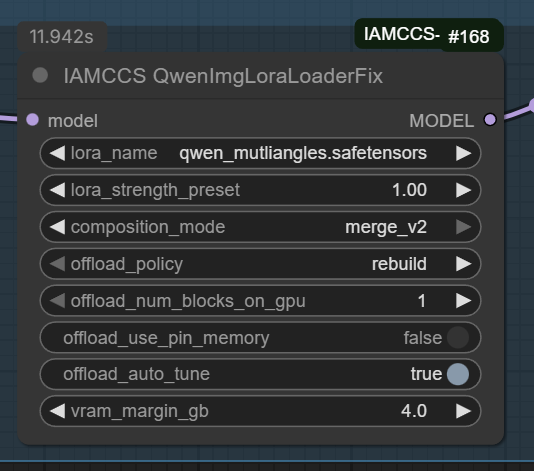

# 🌀 IAMCCS-nodes

## Author: IAMCCS (Carmine Cristallo Scalzi)

### Category: ComfyUI Custom Nodes
### Main Feature: Fix for LoRA loading in native WANAnimate workflows

Version: 1.3.1

# UPDATE VERSION 1-3-1

## 🆕 Version 1.3.1 — WAN SVI Pro Motion Control

](https://github.com/IAMCCS/IAMCCS-nodes/blob/main/assets/wanmotion.png)

Highlights:
- Added `IAMCCS WanImageMotion` node: drop-in replacement for KJNodes `WanImageToVideoSVIPro` with motion amplitude control to fix slow-motion issues in WAN SVI Pro workflows.
- Motion modes: apply boost to `prev_samples` only or all non-first latents.
- VRAM profiles: normal / chunked / per-frame loop / CPU offload for memory-constrained systems.
- `include_padding_in_motion` toggle: enables motion boost on padded frames when anchor has single frame (T=1).
- Comprehensive logging with warnings when motion_range is empty.
- Full documentation: `WanImageMotion.md`

### New Node: IAMCCS WanImageMotion

Use this node in WAN SVI Pro workflows to control motion intensity and prevent slow-motion artifacts.

Inputs:
- `positive` / `negative`: conditioning
- `length`: video length
- `anchor_samples`: base latent samples
- `motion`: motion amplitude (1.0-2.0, default 1.15)
- `motion_mode`: choose where to apply boost
- `motion_latent_count`: frames from prev_samples to use as motion reference
- `include_padding_in_motion`: enable to apply motion on padded frames
- `vram_profile`: memory optimization strategy
- `latent_precision`: dtype control (auto/fp16/fp32)
- `add_reference_latents`: optional conditioning stabilization
- Optional `prev_samples`: previous latents for motion continuity

Outputs:
- Updated `positive` / `negative` conditioning with motion-boosted latents
- `latent`: empty latent for sampling

---

# UPDATE VERSION 1-3-0

## 🆕 Version 1.3.0 — New MODEL IO LoRA Stack + Qwen Loader Instructions

Highlights:
- Added `LoRA Stack (Model In→Out) WAN` node: directly applies up to 4 WAN / Flow / Standard LoRAs to an incoming MODEL and outputs a patched MODEL (ideal for WAN 2.2 workflows where a single node step is preferred).
- Qwen Image LoRA (IAMCCS QwenImgLoadFix) – Updated for 1.3.0: a fixed Qwen Image LoRA loader with improved offload controls and UX.
- Extended internal WAN key remapping for seamless WAN 2.2 (Flow) + WAN 2.1 cross-compatibility.
- Documentation updated with explicit Qwen Image LoRA loader prerequisites for low VRAM users (nunchaku based).
- Version bump across project files.

### New Node: LoRA Stack (Model In→Out) WAN

lora_stack_model_I_O.png

Use this node when you already have a base MODEL loaded (WAN 2.2, Flow, SDXL, etc.) and want a single pass application of multiple LoRAs without an intermediate stack/output hand-off. It mirrors the behavior of the classic stack + apply pair but merges them for simpler graphs (especially animation or chained sampler pipelines).

Inputs:
- `model`: base diffusion MODEL.
- `lora1..lora4` + `strength1..strength4` (skips if "no" or strength == 0.0)
- `model_type`: choose `flow`, `wan2x`, or `standard` to control remapping logic.
- Optional `lora` (LORA) input: allows concatenating a previously built stack from `IAMCCS_WanLoRAStack` for more than 4 total LoRAs.

Output:
- Patched `MODEL` ready for samplers / video pipelines.

Recommended Use (WAN 2.2 workflows):
1. Load base WAN 2.2 / LightX2V model.
2. Add `LoRA Stack (Model In→Out) WAN` and select up to 4 LoRAs.
3. (Optional) Chain a classic `IAMCCS_WanLoRAStack` into the optional `lora` input if you need >4.
4. Connect output to KSampler / Animate nodes.

Why this node: Eliminates one extra node hop, reduces graph complexity and clarifies model lineage in large animation workflows.

## Previous Versions

### Version 1.2.3 — New input lora - add another StackLoraModel (concatenate) + Extended Wan 2.1 Compatibility

### Version 1.2.1

# UPDATE VERSION 1-2-1

## 🆕 Version 1.2.1 — Extended Wan 2.1 Compatibility

The **WAN-style remap** node now supports **LightX2V 2.1 LoRA models**.  
This version extends overall compatibility to all LoRA types — even those without dedicated weight tensors (these will simply display a non-critical “missing optional weights” message).  

This ensures smoother cross-compatibility between LightX2V 2.1 / 2.2 and any WAN-based or character LoRA setup.

See full changelog → [CHANGELOG.md](./CHANGELOG.md)

# Overview

The IAMCCS-nodes package introduces a fix for a key limitation in native WANAnimate workflows:
when users run animation pipelines without the WanVideoWrapper, LoRA models fail to load correctly — most weights are ignored, and the visual consistency breaks.

This package contains two complementary nodes that work together to fix this problem and restore full LoRA functionality while keeping the workflow lightweight and modular.

The IAMCCS Native LoRA System introduces an optimized way to handle multiple LoRAs inside native ComfyUI workflows.
It is composed of two interconnected nodes designed to work seamlessly together.

## 1. LoRA Stack (WAN-style remap)

This node lets you combine several LoRA models—especially those made for WAN2.x / Animate / Flow architectures—into one unified output.

](https://github.com/IAMCCS/IAMCCS-nodes/blob/main/assets/lora%20stack.png)

Each LoRA slot includes:

an independent strength control,

automatic WAN-style key remapping for full compatibility,

and support for .safetensors files across any model type (flow, wan, sdxl, etc).

It produces a stacked LoRA bundle that merges all the active LoRAs and prepares them for efficient native injection.

## 2. Apply LoRA to MODEL (Native)

This node applies the generated LoRA stack directly to a loaded diffusion model at the Torch level, without relying on older ComfyUI Apply LoRA wrappers.

Works natively with FP16 accumulation (recommended when paired with Model Patch Torch Settings)

Maintains precision and speed

Fully compatible with WAN2.x and other Flow-type diffusion models

Output: a ready-to-run patched model for image or video generation.

This structure replaces multiple chained LoRA nodes with a single modular system, improving both stability and performance.
Ideal for WANAnimate, WANVideo, or any Flow-based cinematic model.

# LoRA Concatenation (1.2.3)

lora_concatenatel.png

### LoRA Stack (WAN-style remap)
Supports the following LoRAs:  
- New Moe distill WAN 2.2 LightX2V High Model  
- New Moe distill WAN 2.2 LightX2V Low Model 
- WAN 2.2 LightX2V High Model  
- WAN 2.2 LightX2V Low Model 
- WAN Boost Realism  
- WAN 2.2 LightX2V 4-Step High  
- WAN 2.2 LightX2V 4-Step Low
- Character LoRAs   
- WAN 2.1 LightX2V Model  

# Installation

The node has now been officially accepted on ComfyUI Manager, You can install it directly from there (just search for IAMCCS).

or

You can grab it manually:

digit in your terminal:

 cd ComfyUI/custom_nodes
 git clone https://github.com/IAMCCS/IAMCCS-nodes.git

Compatibility

ComfyUI ≥ 0.3.0

Python ≥ 3.12

Torch ≥ 2.8 (CUDA 12.6 or 12.8)

Compatible with:
WAN2.1, WAN2.2, WANAnimate, WANAnimate_relight, Pulid, Flux, and multi-LoRA setups.

# Technical Insight

LoRA weights fail to load in native WANAnimate pipelines because the model initialization bypasses the internal LoRA merge functions used in the wrapper.
By separating the process into two modular nodes, IAMCCS-nodes restores full LoRA compatibility without depending on WanVideoWrapper, keeping performance high and structure clean.

Node 1 replaces the missing LoRA-loading phase.

Node 2 reintroduces dynamic LoRA reapplication and blending inside the animation graph.

This modular architecture makes LoRA management in WANAnimate flexible, transparent, and fully native.

### If my work helped you, and you’d like to say thanks — grab me a coffee ☕

---

## Qwen Image LoRA (IAMCCS QwenImgLoadFix) – Updated for 1.3.0

This repo ships a fixed Qwen Image LoRA loader with improved offload controls and UX.

LORAQWEN.png

### Prerequisites (Low VRAM Friendly)
Required:
- ComfyUI (≥ 0.3.0)
- `ComfyUI-nunchaku` (Qwen Image / Sana transformer implementation)
- `ComfyUI-QwenImageLoraLoader` (wrappers.qwenimage module with `ComfyQwenImageWrapper`)
- Qwen Image model weights placed as per nunchaku loader instructions
- LoRA files (`.safetensors`) in `ComfyUI/models/loras`

Recommended for low VRAM systems:
- Enable `offload_auto_tune` (auto scales transformer block residency)
- Set `offload_policy=disable` only if you experience instability during composition (keeps everything on GPU while LoRAs active)
- Keep `offload_num_blocks_on_gpu` low (1–2) if VRAM < 12 GB

### Node Overview
`IAMCCS QwenImgLoadFix`
- Wraps a `NunchakuQwenImageTransformer2DModel` / `NunchakuSanaTransformer2DModel` if not already wrapped.
- Adds LoRA via internal wrapper (`model_wrapper.loras.append(...)`) with strength preset.
- Supports composition modes:
  - `append`: legacy shape-changing approach
  - `merge_v2`: in-place delta merge (preferred; no rank expansion)
- Offload Controls: dynamic, rebuild or disable strategies; pin-memory toggle; auto-tune; VRAM margin.
- Device Safety: ensures params & buffers migrate to correct CUDA device before forward.

  

### Dependency Checklist
| Component | Purpose |
|-----------|---------|
| ComfyUI-nunchaku | Provides transformer class loaded by base model node |
| ComfyUI-QwenImageLoraLoader | Supplies `wrappers/qwenimage.py` used for wrapping |
| IAMCCS-nodes | Adds fixed loader + WAN LoRA stack system |
| LoRA safetensors | User-provided style/character adapters |

If `wrappers/qwenimage.py` is not found the node will raise an import error. Ensure `ComfyUI-QwenImageLoraLoader` repository resides in `custom_nodes/`.

### Quick Start (Low VRAM Scenario)
1. Load Qwen Image model (nunchaku loader node).
2. Place `IAMCCS QwenImgLoadFix` directly after it.
3. Select `lora_name` & preset (start with 0.76–1.00 for natural balance).
4. Set `composition_mode=merge_v2` unless you need legacy behavior.
5. Keep `offload_auto_tune=ON`; reduce `offload_num_blocks_on_gpu` if memory errors occur.
6. Run sampler; adjust preset or switch to a higher strength if effect too weak.

### External Requirements Recap
This loader will not function standalone — both `ComfyUI-nunchaku` and `ComfyUI-QwenImageLoraLoader` must be installed, and the Qwen Image weights must be correctly placed. The IAMCCS node auto-wraps only if it detects a supported transformer class. If wrapping fails, verify repository folder names match expected conventions.

