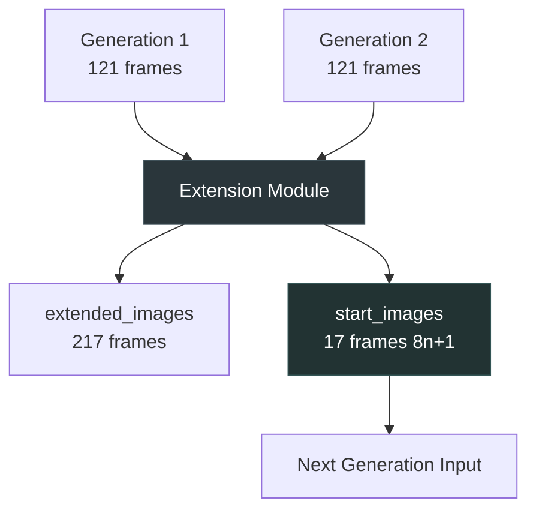

# LTX-2 Extension Module - Complete Technical Guide

## Table of Contents
1. [Overview](#overview)
2. [Architecture & Workflow](#architecture--workflow)
3. [Parameters Reference](#parameters-reference)
4. [Usage Scenarios](#usage-scenarios)
5. [Advanced Features](#advanced-features)
6. [Troubleshooting](#troubleshooting)
7. [Best Practices](#best-practices)

---

## Overview

The **IAMCCS LTX-2 Extension Module** is an all-in-one node designed for iterative video extension workflows with the LTX-2 model. It combines multiple operations into a single, efficient node:

- **Image batch merging** with configurable overlap
- **Multiple blending modes** for smooth transitions
- **Automatic frame calculations** with built-in math operations
- **LTX-2 8n+1 conformance** for start_images
- **Advanced quality features** (color matching, seam search)

### Key Benefits
- ✅ Eliminates need for multiple separate nodes (GetImageRange, ImageBatchExtend, SimpleMath, etc.)
- ✅ Automatic 8n+1 validation prevents encoding errors
- ✅ Seamless video segment concatenation with no visible cuts
- ✅ Flexible overlap strategies for different content types
- ✅ Built-in quality enhancement features

---

## Architecture & Workflow

### Basic Extension Flow



### Complete Multi-Segment Workflow

```
┌─────────────────────────────────────────────────────────────────┐
│                    ITERATIVE EXTENSION LOOP                      │
└─────────────────────────────────────────────────────────────────┘

Iteration 1: Initial Generation
┌──────────────────┐
│  Initial Image   │ 1 frame
└────────┬─────────┘
         │
         v
┌──────────────────┐
│  LTX Sampler     │ Generate 121 frames
│  (8×15 + 1)      │
└────────┬─────────┘
         │
         v
┌──────────────────┐
│   VAE Decode     │ Latent → Images
└────────┬─────────┘
         │
         v
    source_images (121 frames)
         │
         └──────────────────────────────────┐
                                            │
Iteration 2: First Extension                │
┌──────────────────┐                        │
│  Extension       │◄───────────────────────┘
│  Module          │◄── new_images (121 frames from Gen 2)
│  overlap=25      │
│  mode=linear     │
└────────┬─────────┘
         │
         ├──► extended_images (217 frames)
         │    121 - 25 + 121 = 217
         │
         └──► start_images (17 frames)
              25 → 24 (math: a-1) → 17 (8n+1 conform)
                                    │
                                    v
                          ┌──────────────────┐
                          │  LTX Sampler     │ Gen 3 (121 frames)
                          │  uses 17 frames  │
                          └────────┬─────────┘
                                   │
                                   v
                              new_images
                                   │
                                   └──► Loop continues...

Final Output:
┌──────────────────┐
│ Video Segments   │
│ 217 + 217 + ...  │
│ Seamless Concat  │
└──────────────────┘
```

### Internal Processing Flow

```
INPUT IMAGES
     │
     ├─── source_images (previous generation)
     │         │
     │         └─── Last 25 frames ──┐
     │                                 │
     └─── new_images (current generation)
               │                       │
               └─── First 25 frames ───┤
                                       │
                              ┌────────v────────┐
                              │  OVERLAP ZONE   │
                              │    25 frames    │
                              └────────┬────────┘
                                       │
                              ┌────────v────────┐
                              │  BLENDING       │
                              │  linear_blend   │
                              │  Alpha: 0→1     │
                              └────────┬────────┘
                                       │
                    ┌──────────────────┴──────────────────┐
                    │                                     │
          ┌─────────v─────────┐              ┌──────────v──────────┐
          │ extended_images    │              │  start_images       │
          │ Full merged batch  │              │  For next iteration │
          │ (source-25+new)    │              │  With 8n+1 conform  │
          └────────────────────┘              └─────────────────────┘
```

---

## Parameters Reference

### Core Parameters

#### `overlap_frames` (INT)
- **Default**: 10
- **Range**: 1-256
- **Recommended**: 25-40 for smooth transitions
- **Purpose**: Number of frames to overlap and blend between segments

**Impact**:
- **Low (8-15)**: Fast processing, visible seams possible
- **Medium (20-30)**: ✅ **Recommended** - Good balance
- **High (40-60)**: Very smooth, but higher computational cost

**Formula**: `extended_length = source_count - overlap + new_count`

Example with overlap=25:
```
source: [1...121]
new:    [1...121]
overlap: 25 frames
extended: 121 - 25 + 121 = 217 frames
```

---

#### `overlap_side` (DROPDOWN)
- **Options**: `source` | `new_images`
- **Default**: `source`
- **Purpose**: Which batch to take overlap frames from

```
overlap_side = "source":
    Take last 25 from source
    Take first 25 from new
    Blend source→new (recommended)

overlap_side = "new_images":
    Take first 25 from new
    Take last 25 from source
    Blend new→source (reverse)
```

**Use Cases**:
- `source`: ✅ **Standard** - Smooth forward progression
- `new_images`: Experimental - reverse blending effect

---

#### `overlap_mode` (DROPDOWN)
- **Options**: `cut` | `linear_blend` | `ease_in_out` | `filmic_crossfade` | `perceptual_crossfade`
- **Default**: `linear_blend`

### Blending Modes Comparison

| Mode | Speed | Quality | Use Case | Formula |
|------|-------|---------|----------|---------|
| **cut** | ⚡⚡⚡ | ⭐ | Testing, no blend needed | Direct concatenation |
| **linear_blend** | ⚡⚡ | ⭐⭐⭐⭐ | ✅ **General use** | `(1-t)×src + t×dst` |
| **ease_in_out** | ⚡⚡ | ⭐⭐⭐⭐⭐ | Smooth artistic transitions | `3t² - 2t³` |
| **filmic_crossfade** | ⚡ | ⭐⭐⭐⭐⭐ | Color-accurate blending | Gamma 2.2 correction |
| **perceptual_crossfade** | ⚡ | ⭐⭐⭐⭐⭐ | Best quality (needs Kornia) | LAB color space blend |

**Visual Comparison**:
```
Alpha progression over 25 frames:

linear_blend:
0.0 ████░░░░░░░░░░░░░░░░░░░░ 1.0
    │                        │
    Linear interpolation

ease_in_out:
0.0 ██▓▓▒▒░░░░░░░░░░▒▒▓▓████ 1.0
    │   Slow→Fast→Slow      │
    Smooth S-curve

filmic_crossfade:
0.0 ███▓▓▒▒░░░░░░░░░░▒▓▓███ 1.0
    │  Gamma-corrected      │
    Perceptually uniform
```

**Recommendations**:
- **General video**: `linear_blend` (fast, reliable)
- **High quality**: `ease_in_out` (smooth, cinematic)
- **Color-critical**: `filmic_crossfade` or `perceptual_crossfade`
- **Testing/Debug**: `cut` (no blending overhead)

---

#### `enable_math` (BOOLEAN)
- **Default**: `true`
- **Purpose**: Enable mathematical operations on overlap value for start_images calculation

When enabled, applies `math_operation` to calculate the number of frames for `start_images`.

---

#### `math_operation` (DROPDOWN)
- **Options**: `none` | `a-b` | `a-1` | `a+b` | `a*b` | `a/b` | `min(a,b)` | `max(a,b)`
- **Default**: `a-b`
- **Variables**: 
  - `a` = overlap_frames
  - `b` = math_value_b (optional input)

**Common Use Cases**:

| Operation | Example | Result | Use Case |
|-----------|---------|--------|----------|
| `none` | overlap=25 | 25 | Direct use of overlap |
| `a-1` | 25-1 | 24 | ✅ **Standard** - LTX-2 workflow |
| `a-b` | 25-15 | 10 | Custom frame count |
| `a/b` | 25/2.5 | 10 | Proportional reduction |

**Recommended Configuration**:
```json
{
  "overlap_frames": 25,
  "enable_math": true,
  "math_operation": "a-1"
}
```
Result: 25 - 1 = 24 frames → 17 frames (after 8n+1 conform)

---

#### `start_frames_rule` (DROPDOWN)
- **Options**: `none` | `ltx2_round_down` | `ltx2_nearest`
- **Default**: `none`
- **Purpose**: Enforce LTX-2 8n+1 rule for VideoVAE encoding

### LTX-2 Frame Count Rule

LTX-2 VideoVAE requires frame counts following the formula: **`frames = 8n + 1`**

Valid frame counts: `1, 9, 17, 25, 33, 41, 49, 57, 65, 73, 81, 89, 97, 105, 113, 121...`

**Examples**:

| Input | ltx2_round_down | ltx2_nearest | none |
|-------|----------------|--------------|------|
| 24 | 17 (8×2+1) | 17 (closer) | 24 ❌ |
| 26 | 25 (8×3+1) | 25 (closer) | 26 ❌ |
| 30 | 25 (8×3+1) | 33 (closer) | 30 ❌ |
| 17 | 17 ✅ | 17 ✅ | 17 ✅ |

**When to Use**:
- ✅ **Always use** `ltx2_round_down` or `ltx2_nearest` when start_images feeds into a sampler
- ❌ **Never use** when output is only for preview/saving (not encoding)

**Critical**: Without this, you'll get errors like:
```
Error: Expected frame count 8n+1, got 24
```

---

### Advanced Quality Parameters

#### `color_match_mode` (DROPDOWN)
- **Options**: `none` | `luma_only` | `per_channel`
- **Default**: `none`
- **Purpose**: Match color/exposure of new_images to source_images tail

**Use Cases**:
- **Lighting changes**: Different segments with varying brightness
- **Color shifts**: Camera auto-balance between shots
- **Consistency**: Maintain uniform look across segments

```
none:
    source: █████████▓▓▓▓▓ (bright end)
    new:    ▒▒▒▒▒░░░░░░░░ (dark start)
    → Visible seam

luma_only:
    Match overall brightness only
    → Quick, preserves color tone

per_channel:
    Match R, G, B independently
    → Best quality, may shift colors
```

---

#### `color_match_strength` (FLOAT)
- **Range**: 0.0-1.0
- **Default**: 1.0
- **Purpose**: Blend factor for color matching

```
strength = 0.0: No correction
strength = 0.5: Partial correction
strength = 1.0: Full correction
```

---

#### `seam_search_mode` (DROPDOWN)
- **Options**: `none` | `best_of_k`
- **Default**: `none`
- **Purpose**: Search for optimal seam position within overlap zone

**How It Works**:
```
Standard overlap (offset=0):
source: ████████████████████▓▓▓▓▓
new:                        ░░░░░░░░░░░░░░░░░
                            ↑ Potential seam

Best-of-k search (k=8):
Tries offsets 0-8:
offset=0: ▓▓▓▓▓ vs ░░░░░ → score: 0.85
offset=1: ▓▓▓▓▓ vs ░░░░░ → score: 0.72
offset=2: ▓▓▓▓▓ vs ░░░░░ → score: 0.65 ✅ Best!
...
Chooses offset=2 (lowest discontinuity)
```

**Scoring Metrics**:
- Color/luma continuity (weighted by `metric_weight_color`)
- Edge continuity (weighted by `metric_weight_edges`)

**Trade-offs**:
- ✅ Reduces visible seams
- ✅ Handles motion/camera cuts better
- ❌ Slower (tests k candidates)
- ❌ May "skip" frames from new_images

---

## Usage Scenarios

### Scenario 1: Standard Video Extension (Recommended)

**Goal**: Extend a video smoothly without visible seams

**Configuration**:
```json
{
  "overlap_frames": 25,
  "overlap_side": "source",
  "overlap_mode": "linear_blend",
  "enable_math": true,
  "math_operation": "a-1",
  "start_frames_rule": "ltx2_round_down",
  "color_match_mode": "none",
  "seam_search_mode": "none"
}
```

**Workflow**:
1. Generate segment 1 (121 frames)
2. Extract last 17 frames (8×2+1)
3. Generate segment 2 with those 17 frames as reference
4. Extension Module merges with 25-frame overlap
5. Repeat

**Output**: Seamless 217-frame video (then 313, 409, etc.)

---

### Scenario 2: High-Quality Cinematic Extension

**Goal**: Maximum quality with perceptual blending

**Configuration**:
```json
{
  "overlap_frames": 40,
  "overlap_side": "source",
  "overlap_mode": "perceptual_crossfade",
  "enable_math": true,
  "math_operation": "a-1",
  "start_frames_rule": "ltx2_nearest",
  "color_match_mode": "per_channel",
  "color_match_strength": 0.8,
  "seam_search_mode": "best_of_k",
  "k_search": 16
}
```

**Best For**:
- Film production
- High-resolution output
- Color-critical content
- Complex lighting scenarios

---

### Scenario 3: Fast Preview / Testing

**Goal**: Quick iteration, minimal processing

**Configuration**:
```json
{
  "overlap_frames": 10,
  "overlap_side": "source",
  "overlap_mode": "cut",
  "enable_math": true,
  "math_operation": "a-1",
  "start_frames_rule": "ltx2_round_down",
  "color_match_mode": "none",
  "seam_search_mode": "none"
}
```

**Best For**:
- Testing prompts
- Workflow debugging
- Quick previews

---

### Scenario 4: Lighting-Corrected Extension

**Goal**: Handle varying lighting between segments

**Configuration**:
```json
{
  "overlap_frames": 30,
  "overlap_side": "source",
  "overlap_mode": "ease_in_out",
  "enable_math": true,
  "math_operation": "a-1",
  "start_frames_rule": "ltx2_round_down",
  "color_match_mode": "luma_only",
  "color_match_strength": 1.0,
  "color_reference_window": 12
}
```

**Best For**:
- Outdoor scenes (sun changes)
- Mixed lighting conditions
- Auto-exposure variations

---

## Advanced Features

### Two-Stage Overlap Strategy

Replicating the "early version" workflow behavior with separate overlap values:

```python
# Early version used:
# - overlap=10 for frame extraction
# - overlap=25 for blending

# Extension Module equivalent:
{
  "overlap_frames": 25,        # For blending
  "math_operation": "a/b",     # Calculate extraction
  "math_value_b": 2.5,        # 25/2.5 = 10
  "start_frames_rule": "ltx2_round_down"
}

# Result:
# - Blending uses 25 frames (smooth)
# - start_images calculated from 10 → 9 → 9 frames (8×1+1)
```

---

### Custom Frame Count Calculation

**Example**: Generate 33 frames for next iteration (8×4+1)

```json
{
  "overlap_frames": 25,
  "math_operation": "a+b",
  "math_value_b": 9,          // 25 + 9 = 34
  "start_frames_rule": "ltx2_round_down"  // 34 → 33
}
```

---

### Adaptive Overlap with AutoLink

When using AutoLink for iterative loops:

```json
{
  "overlap_frames": 25,
  "autolink_overlap_in": 0,   // Override if > 0 from AutoLink
  // ... other params ...
}

// Extension Module outputs:
// autolink_overlap_out → feeds next iteration's autolink_overlap_in
```

---

## Troubleshooting

### Problem: Visible seams between segments

**Symptoms**: Hard cuts, color shifts, motion jumps

**Solutions**:
1. ✅ Increase `overlap_frames` to 25-40
2. ✅ Change to `ease_in_out` or `filmic_crossfade`
3. ✅ Enable `color_match_mode = "luma_only"`
4. ✅ Try `seam_search_mode = "best_of_k"` with `k_search = 8`

---

### Problem: Error "Expected 8n+1 frames"

**Symptoms**: Workflow fails at sampler/encoder

**Solutions**:
1. ✅ Set `start_frames_rule = "ltx2_round_down"`
2. ✅ Verify `enable_math = true`
3. ✅ Check math formula produces reasonable values
4. ❌ Don't use `start_frames_rule` if output is for preview only

---

### Problem: Videos too long / memory issues

**Symptoms**: Out of memory, slow processing

**Solutions**:
1. ✅ Reduce `overlap_frames` to 15-20
2. ✅ Use `overlap_mode = "linear_blend"` (faster)
3. ✅ Disable `seam_search_mode`
4. ✅ Process in smaller batches

---

### Problem: Color mismatch at seams

**Symptoms**: Brightness/hue shifts visible

**Solutions**:
1. ✅ Enable `color_match_mode = "per_channel"`
2. ✅ Set `color_match_strength = 0.8-1.0`
3. ✅ Increase `color_reference_window` to 16-24
4. ✅ Use `filmic_crossfade` for gamma-correct blending

---

## Best Practices

### 1. Start with Recommended Defaults

```json
{
  "overlap_frames": 25,
  "overlap_side": "source",
  "overlap_mode": "linear_blend",
  "enable_math": true,
  "math_operation": "a-1",
  "start_frames_rule": "ltx2_round_down",
  "color_match_mode": "none",
  "seam_search_mode": "none"
}
```

Then optimize based on your specific needs.

---

### 2. Overlap Guidelines by Content Type

| Content Type | Overlap | Blend Mode | Reason |
|--------------|---------|------------|--------|
| **Static scenes** | 15-20 | linear_blend | Less motion, simpler blend |
| **Camera movement** | 25-40 | ease_in_out | Smooth motion transition |
| **Fast action** | 30-50 | filmic_crossfade | Avoid motion artifacts |
| **Talking heads** | 20-30 | linear_blend | Consistent framing |
| **Nature/landscape** | 25-35 | perceptual_crossfade | Color accuracy |

---

### 3. Processing Order

Always follow this order in your workflow:

```
1. Initial Image
   ↓
2. LTX Sampler (8n+1 frames)
   ↓
3. VAE Decode
   ↓
4. Extension Module
   ├─→ extended_images (for final output)
   └─→ start_images (for next iteration)
   ↓
5. Loop back to step 2
```

**Critical**: Never feed `extended_images` back into the sampler directly - always use `start_images` (conformant to 8n+1).

---

### 4. Testing Workflow

Before full production:

1. Test with `overlap=10`, `mode=cut` (fast preview)
2. Verify no errors with `start_frames_rule = "ltx2_round_down"`
3. Increase overlap to 25, switch to `linear_blend`
4. Fine-tune with quality features if needed

---

### 5. Output Validation

Check the `report` output for each iteration:

```
Source: 121 frames | 
Overlap (effective): 25 frames | 
Start range: start_index=96, num_frames=17 | 
Math: a-1 | 
Start frames rule: ltx2_round_down | 
Extended: 217 frames | 
Extension delta: +96 frames | 
Blend mode: linear_blend
```

Verify:
- ✅ `num_frames` is 8n+1 (9, 17, 25, 33, etc.)
- ✅ `Extension delta` is positive
- ✅ No warnings in console

---

## Performance Optimization

### Memory Usage

| Configuration | Memory Impact | Speed |
|---------------|---------------|-------|
| overlap=10, cut | Low | ⚡⚡⚡ |
| overlap=25, linear | Medium | ⚡⚡ |
| overlap=40, ease_in_out | Medium-High | ⚡⚡ |
| overlap=40, perceptual + seam search | High | ⚡ |

---

### Batch Processing Tips

For very long videos (10+ segments):

1. **Save intermediate results**:
   ```
   Segment 1 → Save
   Segment 2 → Save
   ...
   Final concatenation separately
   ```

2. **Use progressive overlap**:
   ```
   Segments 1-3: overlap=25 (quality)
   Segments 4+: overlap=15 (speed)
   ```

3. **Monitor VRAM**:
   - Each 121-frame batch ≈ 4-8GB VRAM
   - Reduce resolution if needed

---

## Workflow Diagrams

### Complete Extension Pipeline

```
┌────────────────────────────────────────────────────────────────┐
│                     INITIALIZATION                              │
└────────────────────────────────────────────────────────────────┘

┌─────────────┐     ┌─────────────┐     ┌─────────────┐
│ Load Model  │────>│ Load VAE    │────>│ Load CLIP   │
└─────────────┘     └─────────────┘     └─────────────┘
       │                   │                   │
       └───────────────────┴───────────────────┘
                           │
                           v
┌────────────────────────────────────────────────────────────────┐
│                   GENERATION LOOP START                         │
└────────────────────────────────────────────────────────────────┘

Iteration N:
┌─────────────┐
│ start_images│ (17 frames, 8×2+1)
│ from prev   │
└──────┬──────┘
       │
       v
┌─────────────────────────────────────────────────────────────┐
│  SUBGRAPH: Samplers                                         │
│  ┌─────────────┐     ┌─────────────┐     ┌─────────────┐  │
│  │ VAE Encode  │────>│ LTX Sampler │────>│ VAE Decode  │  │
│  │ (to latent) │     │ (121 frames)│     │ (to images) │  │
│  └─────────────┘     └─────────────┘     └─────────────┘  │
└─────────────────────────────────────────────────────────────┘
       │
       v
   new_images (121 frames)
       │
       └──────────────────────────┐
                                  │
┌─────────────────────────────────v──────────────────────────┐
│  Extension Module                                          │
│                                                            │
│  source_images (121) + new_images (121)                   │
│              │                                             │
│              v                                             │
│  ┌────────────────────────┐                               │
│  │ Overlap Extraction     │                               │
│  │ Last 25 from source    │                               │
│  │ First 25 from new      │                               │
│  └────────┬───────────────┘                               │
│           │                                                │
│           v                                                │
│  ┌────────────────────────┐                               │
│  │ Blending               │                               │
│  │ Mode: linear_blend     │                               │
│  │ Alpha: 0→1 over 25     │                               │
│  └────────┬───────────────┘                               │
│           │                                                │
│           v                                                │
│  ┌────────────────────────┐                               │
│  │ Concatenation          │                               │
│  │ [prefix][blend][suffix]│                               │
│  └────────┬───────────────┘                               │
│           │                                                │
│           ├─────────────────────────────┐                 │
│           │                             │                 │
│           v                             v                 │
│  extended_images (217)      start_images (17, 8n+1)       │
│           │                             │                 │
└───────────┼─────────────────────────────┼─────────────────┘
            │                             │
            v                             └─> Next Iteration
    ┌───────────────┐
    │ CreateVideo   │
    │ Concatenate   │
    │ with Audio    │
    └───────┬───────┘
            │
            v
    ┌───────────────┐
    │  SaveVideo    │
    │  Final Output │
    └───────────────┘
```

---

### Overlap Blending Visualization

```
Source Batch (121 frames):
[████████████████████████████████████████████████████▓▓▓▓▓▓▓▓▓▓▓▓▓▓▓▓▓▓▓▓▓▓▓▓▓]
                                                      └─ Last 25 frames ─┘

New Batch (121 frames):
                                                      [░░░░░░░░░░░░░░░░░░░░░░░░░████████████████████████████████████████████████████]
                                                      └─ First 25 frames ─┘

Blending Zone (25 frames with linear alpha):
Frame:   1    2    3    4    5  ...  23   24   25
Alpha: 0.00 0.04 0.08 0.12 0.16 ... 0.92 0.96 1.00
       ████ ███▓ ███▒ ██▒░ ██░░ ... ░▒██ ░▓███ ░███
       
Blended: (1-α)×source + α×new

Extended Result (217 frames):
[████████████████████████████████████████████████████▓▓▒▒░░████████████████████████████████████████████████████████████████████]
                                                      └─ Smooth transition ─┘
```

---

## Conclusion

The Extension Module provides a powerful, flexible solution for iterative video generation with LTX-2. Key takeaways:

1. **Always use 8n+1 conformance** (`ltx2_round_down`) when feeding samplers
2. **Start with overlap=25** and `linear_blend` for best results
3. **Enable quality features** (color match, seam search) only when needed
4. **Monitor the report output** to verify correct operation
5. **Test with simple configs first**, then optimize

For support and updates, see the [IAMCCS-nodes repository](https://github.com/IAMCCS/IAMCCS-nodes).

---

*Document Version: 1.0*  
*Last Updated: January 2026*  
*Extension Module Version: 87665e5*
